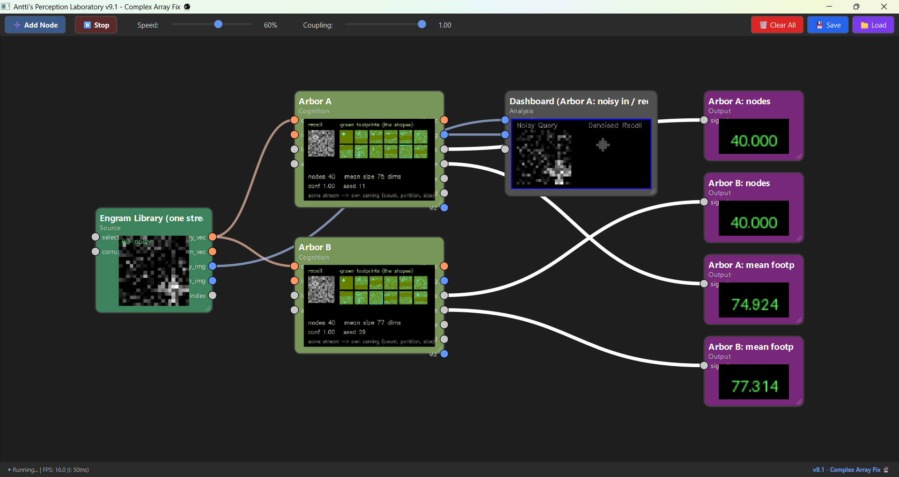

# Divergent Arbors



### The same stream carves a different organization in every mesh — and the knowledge crosses anyway

**PerceptionLab / Antti Luode, with Claude (Opus 4.8). Helsinki, June 2026.**
*A sub-folder of the Mycelial Cortex repo, alongside Priming Tide. (Rename to README.md inside the folder.)*

> Do not hype. Do not lie. Just show.

---

## The one idea

Federation showed two peers grow *different* internal models from the *same* token stream — knowledge federates, weights do not. A neuron's shape is its computation (cable theory: shape is the filter), and brains grow different shapes from experience. So the sharp question is: **when two meshes diverge on the same stream, where does the divergence live?**

This folder gives each node a grown **footprint** (a receptive shape, carved by activity with lateral competition) and measures the answer:

- **Organization diverges** — different node count, different partition, different sizes.
- **Knowledge converges** — both recall the same content from the same query.
- **Per-node shape does *not* diverge** — a unit's footprint tracks the stimulus it specialized on, not the peer's history.

It is **degeneracy** (Marder; Edelman & Gally) — the same function from different structures — **localized**: the degeneracy lives in the *carving* (how many units, how the space is partitioned), not in the receptive field of any single unit, and not in the recalled knowledge.

---

## The verified numbers

`shape_divergence_proof.py` teaches two meshes the same six patterns with a different prior and a reordered stream (the live federation conditions), against a control with identical prior and order. Fixed seeds, reproducible:

| | Peer A | Peer B |
|---|---|---|
| nodes grown | **7** | **9** |
| partition (nodes/pattern) | `[1,2,1,1,1,1]` | `[1,1,1,1,2,3]` |
| mean footprint size | 13.1 dims | 11.4 dims (of 64) |
| recall -> truth | 0.76 / 78% | 0.75 / 78% |

- cross-peer recall agreement: **cos 0.81** (same query, same recalled content)
- per-node footprint cos(A,B): **0.98** (the shape of a unit tracks the stimulus)
- control (identical prior + order): footprint cos **1.00**, counts match — divergence is caused by *history*, not by noise.

```
ORGANIZATION DIVERGES   (count, partition, size)
KNOWLEDGE CONVERGES      (recall, recognition, cross-peer agreement)
PER-UNIT SHAPE CONVERGES (footprint tracks the stimulus, not the peer)
```

---

## Components

| node / file | role |
|---|---|
| `morphogeneticcortexnode.py` | a Mycelial Cortex whose nodes grow a receptive **footprint** (shape) via lateral competition; viz shows the grown shapes, node count, mean size |
| `shape_divergence_proof.py` | headless numpy proof — two meshes, same stream, the verified numbers above + a control |
| `divergent_arbors_loop.json` | live workflow: two meshes (different seed) on one Engram stream, carving it into different organizations |
| `the_divergent_arbor.md` | the condensed paper, with the ledger |

Needs the Mycelial Cortex base nodes in `nodes/`: `patternmemorybanknode.py`, `cognitivedashboardnode.py`.

---

## Quickstart

**Headless proof (no GUI):**
```bash
python shape_divergence_proof.py
```
Prints the divergent run and the control.

**Live:** drop `morphogeneticcortexnode.py` in `nodes/`, load `divergent_arbors_loop.json`. Two meshes read the same Engram stream. Watch each viz fill with a gallery of grown footprint **shapes**, and watch **Arbor A: nodes** and **Arbor B: nodes** (and the mean sizes) drift apart while both keep recalling the shapes. Divergence here comes from each mesh's `spawn_jitter` (internal noise); the federation route — different prior + reordered stream over the token relay — is the other way, and it is the one the proof measures.

---

## The honest ledger

**Verified (reproducible, fixed seeds):** same stream -> divergent organization (7 vs 9 nodes, different partition, different sizes), convergent knowledge (recall 0.76/0.75, recognition 78%/78%, agreement 0.81), convergent per-node shape (cos 0.98, control 1.00).

**Clean mappings:** footprint with lateral competition = receptive territory carved by activity (shape is the filter; Rall, Grubb & Burrone, Kuba); the localization of degeneracy — form diverges, the basis-independent function federates — consistent with `the_unnatural_direction.md`.

**Honest limits:** six near-orthogonal patterns, one corruption level, relative units; recall ~0.76 is the middling standalone-mesh number; "shape" is which input dims a unit claims, not a 3D morphology; divergence shown from prior+order (proof) or internal noise (live), single mesh-pair, biophysics untested.

**The bet (untouched):** that any of this is experienced. A substrate that grows shapes and carves the same experience differently while recalling the same thing — and honest about being only that.

---

## Where it goes next

Run it as a real two-machine federation (two PerceptionLab instances over the token relay, each a Morphogenetic Cortex taught the same patterns) and measure the three quantities on the live meshes. If the live numbers match the headless proof, the claim is demonstrated, not simulated: the same stream carves different arbors on different machines, and the knowledge crosses anyway.

---

## Lineage

Built on the Mycelial Cortex (federation, the token protocol) and the Geometric Neuron line (shape is the filter; the basis-independence of the arrow). The framing — locating where federation's divergence lives — is Antti Luode's; the node, proof, workflow, and document were developed with Claude (Opus 4.8). MIT.

*The same flow carves a different bed in every basin, and the water still arrives. What federates is where the water goes; what diverges is the shape of the channel. Do not hype. Do not lie. Just show.*
