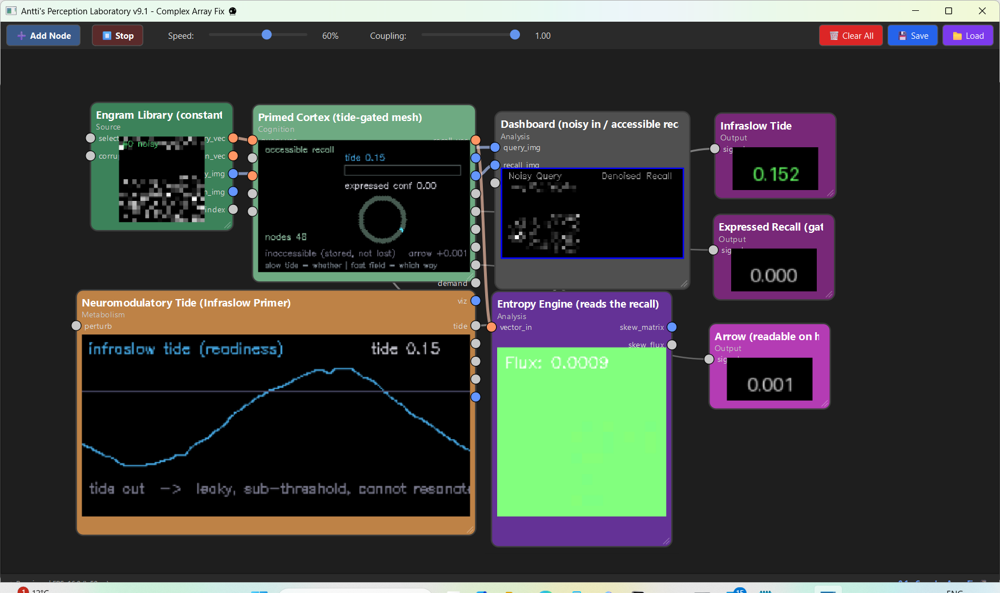

# The Priming Tide

## How a slow chemical readiness gates a fast geometric resonance — the neuromodulatory primer of the Mycelial Cortex

*PerceptionLab / Antti Luode, with Claude (Opus 4.8), and dialogue with Gemini. Helsinki, June 2026.*

> Do not hype. Do not lie. Just show.

---

## 0. What this adds

The Mycelial Cortex line had a fast primer and no slow one. The held membrane field primes the spike inside one cell; the local ephaptic field — weak, ~100 µm, millisecond — was the candidate primer for the population: *the memory of the water that knows direction*. But an ephaptic field cannot hold a state for ten seconds. It tracks spikes. So the question that opened this document was simple and forced: if there is a slow primer, and it cannot be electrical, **how does a slow chemical bath prime a fast geometric resonance without being either the pattern or the direction?**

The answer is one physical variable — **membrane conductance** — and it splits the labour cleanly. The earlier line gave the arrow a heading (`A`) and a grain (the cost of reversing it). This gives the arrow a **power supply**, and locates the power supply in chemistry.

This also corrects a timescale error already in the running system. The `ATPMetabolismNode` is a slow variable that gates recall — but it is *reactive*: it burns on demand and forces rest, a relaxation oscillator driven by the work. The neuromodulatory signal this document is about is *spontaneous*: it fluctuates on its own, before the cue, and **predicts** the trial rather than being caused by it. They are two different slow variables with two different jobs. The fix is not to re-time ATP; it is to add the autonomous tide ATP never modelled.

---

## 1. Two primers, two jobs — *whether* versus *which way*

State everything in one line and the rest is bookkeeping:

> A slow scalar chemical state decides **whether** the substrate is allowed to resonate. A fast geometric electrical field decides **which way** it turns. The chemistry is the readiness; the field is the steering.

| | the slow primer | the fast primer |
|---|---|---|
| substance | neuromodulator (histamine, exemplar) | local ephaptic field |
| transmission | volume / diffuse, chemical | electrical, ~100 µm local |
| timescale | infraslow, 0.05–0.1 Hz (10–20 s) | millisecond |
| what it carries | a **scalar** — readiness, gain | a **geometry** — the skew operator `A`, direction |
| engine role | the gain on β (and, predicted, on α) | the directional nudge toward the resonant channel |
| answers | *whether* recall happens | *which* memory, in *what* direction |

Crucially the chemical signal carries **no pattern and no direction**. It is not the cue, not the engram, not the arrow. It is permission. That is exactly what the Nagoya group found: the histaminergic signal does not encode *what* to recall; it sets a state in which an incoming cue either recruits the stored ensemble or fails to.

---

## 2. The physical variable: membrane conductance

The chemistry touches the geometry at exactly one place — the leak.

**Histamine closes a resting K⁺ leak conductance.** Via H1 and H2 receptors, histamine depolarizes neurons largely by blocking a resting potassium leak current (and modulating I_h and other K⁺ currents). This is established pharmacology (Haas, Sergeeva & Selbach 2008 — the review cited as ref 16 in the Nagoya paper; McCormick & Williamson). Two consequences follow, and both are textbook, not conjecture:

**(1) The cable becomes less leaky → α rises toward lossless.** Closing leak channels lowers membrane conductance, so input resistance `Rₘ = 1/g` rises, and the electrotonic length constant `λ = √(rₘ/rᵢ)` rises with it. A longer λ means a signal travelling down the dendrite attenuates *less* per unit length. In the framework's terms the per-compartment attenuation `αᵏ` of the Takens delay line — already grounded as cable attenuation in `the_geometric_neuron_grounded.md` — moves toward 1. The orbit stays coherent over more of the arbor; the boat does not drag on the canyon bottom. **This is the strongest link in this document: established H1/H2 pharmacology + established cable theory + the framework's existing α-mapping, chained.** It is a clean structural identity, not a bet.

**(2) Resting potential rises toward threshold → excitability up.** Depolarization brings the cell closer to firing, so a resonant match that would have been subthreshold now crosses. In the engine this readiness is the gain on the recall sharpness β: with the tide in, weaker resonant overlaps win the competition and the attractor pull is sharper; with the tide out, the softmax flattens and recall blurs. **This is a fair structural mapping but a softer one than α** — physiologically it is a gain/excitability effect, and β in the engine conflates gain with winner-take-all sharpness. Keep it labelled an interpretation. (The engine already implements ATP→β; this only renames and re-times the knob.)

So histamine is not magic and not information. It is a slow hand on two dials the engine already has: **α up** (the cable carries the orbit coherently) and **β up** (the readout fires on a fainter match).

---

## 3. How the fast and slow primers meet without contradicting each other

They never compete, because they are on different axes:

- **Tide out** — leak open, Rₘ low, α low, β low, resting potential far from threshold. The fast ephaptic steering field still ripples through, pushing toward the resonant channel — but it hits dry rock. The threshold is out of reach, the cable is leaky, the orbit dissipates before the AIS. The substrate is **pattern-blind and time-blind**: the memory is intact but the field cannot resonate to it. *Stored, inaccessible.*
- **Tide in** — leak closed, the cells taut, α high, β high, resting potential near threshold. Now the same fast ephaptic nudge — the carried current `A`, the memory-of-the-water-that-knows-direction — lands on a primed grating that snaps into a spike. *Stored, accessible, and the arrow is readable.*

The chemical state decides if the engine runs; the ephaptic field and the AIS geometry decide which way it turns. You do not choose between a chemical primer and an electrical one. **Biology uses the slow chemical bath to switch on the power supply for the fast geometric antenna.**

---

## 4. The Nagoya rhyme — and the honest scale separation

Morishita et al. (Neuron, 2026) showed, in mice, that spontaneous pre-cue activity of histaminergic tuberomammillary neurons — infraslow (0.05–0.1 Hz), tracking an integrated brain-body state — gates trial-by-trial expression of a reward memory: cues delivered during high-histamine states recalled ~40% better; optogenetic suppression before the cue impaired recall; the effect ran through selective amplification of the canonical cue-evoked basolateral-amygdala population response.

What this paper *is* for this work: **empirical evidence for the form, not the substrate.**

- It demonstrates that the brain implements exactly the architecture this document needs — *a slow, spontaneous, pre-arrival state that gates whether a fast specific input recruits a stored pattern.* Pre-cue state predicts the trial. Readiness sits in the system before the content arrives. That de-risks the *shape* of the idea.
- It is **not** evidence for the ephaptic field carrying `A`, nor for any of the single-cell geometry. The K⁺-leak mechanism in §2 is borrowed from *separate* established pharmacology, not from this paper. Keep them in different drawers: the paper supplies the systems-level proof that the form exists; the conductance literature supplies the candidate implementation.
- Histamine is an **exemplar of a class**, not unique. Acetylcholine (muscarinic / M-current), noradrenaline, and serotonin all close leak-type K⁺ conductances and raise excitability. The slow primer is "a neuromodulatory readiness signal"; histamine is the one this paper happened to measure, at the one timescale that matters here.
- The paper is careful that this is **not arousal** — pupil and global EEG did not explain it, and brief activation did not shift global state. It is a permissive, state-setting signal. That is precisely *whether, not what* — it supports the §1 division rather than a generic "more aroused = better."

So the earlier instinct — *perhaps the infraslow paper does not relate* — was backwards. It relates strongly, but one floor up, as the systems-scale demonstration that the slow-gates-fast architecture is real in tissue.

---

## 5. What the engine shows

Two nodes and one workflow make the claim runnable and falsifiable.

`NeuromodulatoryTideNode` is a free-running infraslow oscillator (~0.07 Hz) with slow correlated wander — spontaneous, autonomous, optionally perturbed by task events (the paper's Fig. S4 transient), explicitly *not* the demand-driven ATP relaxation oscillator. It outputs a scalar `tide` (readiness), a `high_state` flag and a `cue_gate` for closed-loop cueing.

`PrimedCortexNode` is the Mycelial Cortex with the tide on the dial: `β_eff = β · gain(tide)` and an **expression gate** `express = smoothstep(tide)` that scales reported confidence and the recalled image. The recalled vector is *always* computed — the memory is never lost — but it is only *expressed* when the tide is in. That is the paper's "lost vs inaccessible" distinction (Ryan & Frankland 2022; Frankland et al. 2019) made literal in code: drop the tide and a perfectly stored memory becomes unreadable; raise it and the same query recalls cleanly.

The demonstration in `priming_tide_loop.json`: the Engram Library streams the *same* corrupted shapes at constant difficulty; the tide breathes underneath at infraslow; and the **expressed-recall confidence rises and falls with the tide phase while the input never changes.** That is Morishita et al.'s Figure 3 — high-state vs low-state recall of an identical cue — reproduced in the substrate. As a free consequence, the arrow-of-time readout sharpens only on the high tide (at low β the winner traffic is too noisy to carry a stable skew circulation), so direction becomes readable exactly when readiness allows — the §1 claim, emergent rather than imposed.

What is **not** shown here: the α / cable-losslessness effect of §2(1). The current cortex node has no explicit `αᵏ` to modulate — its `leak` parameter is field-persistence in the recall iteration, not cable attenuation, and faking the α effect onto it would be a lie. α stays a labelled prediction for the next build (§7).

---

## 6. Ledger

**Established (used, not claimed):**
- histamine closes a resting K⁺ leak conductance and depolarizes neurons via H1/H2 receptors (Haas, Sergeeva & Selbach 2008; McCormick & Williamson); ACh/NA/5-HT do likewise — neuromodulatory excitability is a class effect;
- closing leak raises input resistance Rₘ and the length constant λ; higher λ means less attenuation down the cable (cable theory; Rall);
- infraslow (0.05–0.1 Hz) histaminergic pre-cue state gates trial-by-trial memory expression via selective amplification of the canonical cue-evoked BLA population response, and is not explained by arousal (Morishita et al. 2026);
- retrieval failure as reduced *accessibility* rather than loss of the engram (Ryan & Frankland 2022; Frankland et al. 2019).

**Clean structural mappings (sound, this document's strongest ground):**
- histamine → K⁺ leak closed → Rₘ↑ → λ↑ → α (cable attenuation, framework's existing mapping) ↑ toward lossless. Chained from established pharmacology + established cable theory; **a structural identity, not a bet**;
- the slow chemical primer is a **scalar readiness** (gain), carrying neither pattern nor direction — matching the paper's "whether, not what."

**Interpretations (fair, softer — labelled):**
- excitability/gain ⇒ the recall sharpness β; β conflates gain with softmax winner-take-all, so this is an engine interpretation, not the tight identity α is;
- the expression gate reproduces "stored but inaccessible" — a faithful behavioural analogue of the paper's result, not a mechanistic claim about how the BLA does it.

**Model hypotheses (falsifiable, unproven):**
- that the **fast** primer — the one carrying direction `A` — is specifically the local ephaptic field (the framework's standing bet, untouched here);
- that the slow tide also raises the dendritic α in the literal cable sense inside a single geometric neuron, sharpening the Takens orbit — predicted, not yet in code;
- that biological pre-cue priming is, mechanistically, this two-dial (α, β) conductance gate.

**The bet (untouched):** that the primed, resonating field is *experienced* rather than processed. The tide explains *whether* the engine runs and *how* a slow chemistry licenses a fast geometry. It does not explain why the running is *like* anything. Located more precisely; not closed.

---

## 7. The one concrete next build

Make the α prediction real and numerical. Build a cortex node with an **explicit Takens buffer** of each node's overlap history — `Xₖ = αᵏ·x(t−kτ)` — and let the tide set α directly: low tide → small α (the orbit decays in a few lags, recall fragments), high tide → α near 1 (the orbit stays coherent, recall locks). Then show, in one figure, that **the same query is unrecallable on the low tide and clean on the high tide for a reason that is mechanistically the cable, not just the readout** — separating the α effect (coherence) from the β effect (sharpness), and predicting that the two dissociate. Pair it with the closed-loop demo (`cue_gate` triggers the Engram Library only on the rising high tide) to reproduce the +40% high-vs-low recall of Morishita et al. directly.

If that holds, the line will have shown the full primer stack in runnable code: a slow chemical hand raising α and β, a fast ephaptic field carrying the direction `A`, and an AIS grating that catches the nudge only when the tide is in.

---

*Helsinki, June 2026. The chemistry does not know the memory and does not know the way. It only closes the leak, raises the water, and lets the fast geometry resonate. Whether the substrate is allowed to think is a slow tide; which way it turns is a fast field; and the two never fight, because one is the power and the other is the steering. Do not hype. Do not lie. Just show.*
