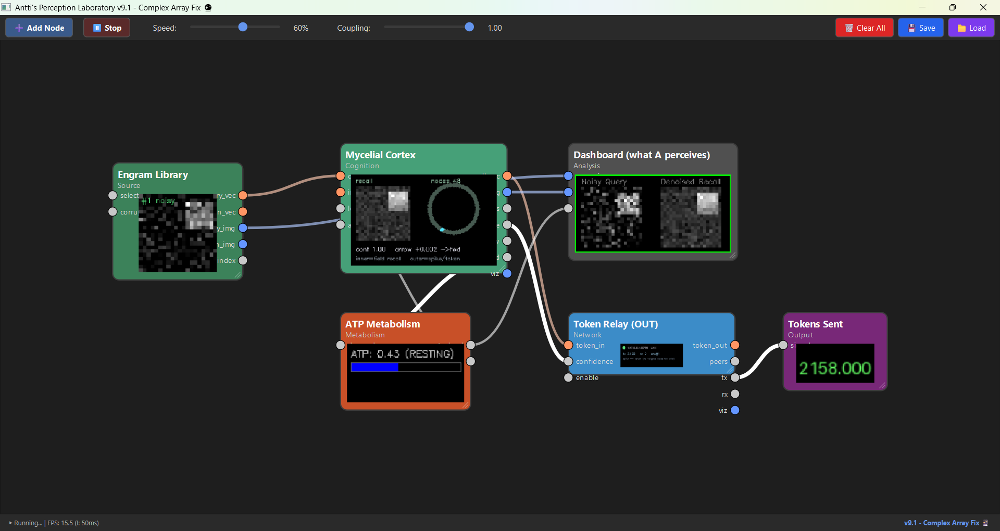
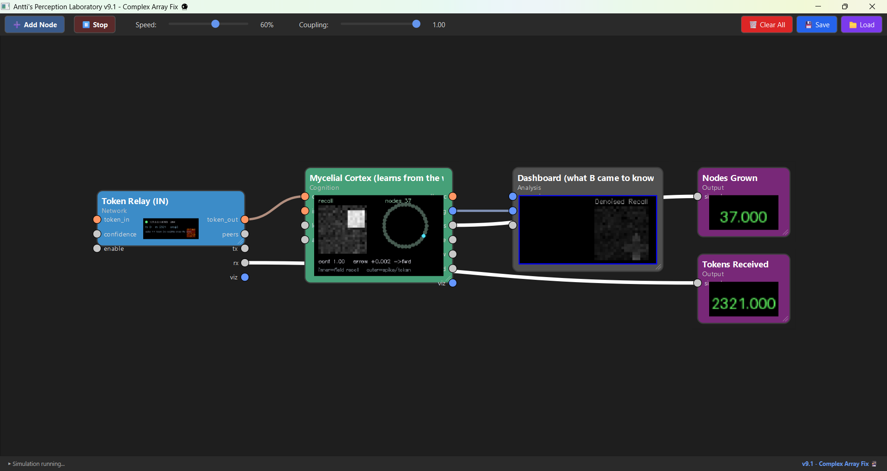

# The Mycelial Cortex

Uses perception lab 12: 

https://github.com/anttiluode/PerceptionLab

(Has all the nodes) 

Easier install: 

https://huggingface.co/spaces/Aluode/PerceptionLabPortable

(Does not contain all the nodes) 

The nodes folder here contains some other nodes from yesterday too. All of this relates to my earlier github repos. 

### A distributed holographic spiking substrate — geometric neurons that recall, grow, tire, read the arrow of time, and federate across machines with nothing but tokens



**PerceptionLab / Antti Luode, with Claude (Opus 4.8). Helsinki, June 2026.**

> Do not hype. Do not lie. Just show.

---

## What this is

A spread of geometric neurons sharing one field. It is content-addressable memory that **recalls** a clean pattern from a corrupted one, **grows** a new node when something novel arrives, **tires** (ATP/fatigue gates learning and forces rest), reads the **arrow of time** of its own spike traffic, and **federates**: two PerceptionLab instances on two machines become one mesh, connected only by a token relay. A memory taught on one is learned and recalled on the other — carried as spikes/tokens, never as weights.

The whole thing rests on one identification: **a spike is a token.** A geometric neuron turns a continuous resonance into a discrete, sparse broadcast; that broadcast is the same kind of object a token-based AI emits. So the substrate is just *a shared field + a token protocol*, and anything that speaks tokens — a sensor, another mesh, an LLM — can join it by resonance.

---



## It works (live)

Running across two instances on a relay:

- **Teacher (A):** Engram Library cycles shapes → Mycelial Cortex recalls them (conf 1.00) → Token Relay broadcasts them (1262 tokens sent). ATP breathing (0.31, resting).
- **Listener (B):** its *only* input is the wire. It grew **31 nodes from tokens alone**, recalls the shapes A taught (its dashboard shows them), having received **zero weights** — only ~1300 tokens.

Headless proof (`federation_proof.py`): a secret pattern known only to A was recalled on B at **cos 0.77**, B's learned template **cos 0.97** to the secret, via **39 sparse tokens**, no shared weights.

The key property: A and B build *different* internal models (different node counts, different organization) from the same token stream. The substrate federates **knowledge, not weights** — each peer organizes shared experience its own way.

---

## The arc (how the pieces fit)

1. **`the_rotation_half_grounded.md`** — the theory. Every engine in the line reads one operator's *skew half* `A = (Cτ − Cτᵀ)/2`. That skew operator *is* the asymmetric sequence connectivity STDP builds (Sompolinsky–Kanter 1986), and its cyclic flux *is* broken detailed balance — so direction (the arrow of time) and energy cost are one statement.
2. **`README_metabolic_loop.md`** — `spike == wattage`. The delta-code billed in ATP; energy spent only at transitions; the wattage curve and the entropy/skew-flux curve are the same curve (r ≈ 0.99).
3. **`the_mycelial_cortex.md`** — the distributed design: anatomy (dendrite = Takens line, AIS = holographic antenna, axon = token), the inner/outer split (field recall vs sparse broadcast), growth, federation.
4. **`README_federation.md`** — the two-machine build, run guide, and verified numbers.

---

## Components

| node / file | role |
|---|---|
| `MycelialCortexNode` | the distributed mesh: recall + grow + consolidate + arrow-of-time, in one node |
| `MetabolicSpikeNode` / `EntropyMeterNode` | spike=wattage meter; detailed-balance regime + Landauer floor |
| `ATPMetabolismNode` | the relaxation oscillator: burns ATP on recall, forces rest, gates growth |
| `PatternMemoryBankNode` | the "dataset": shape templates, corrupted queries |
| `CognitiveDashboardNode` | noisy-query vs denoised-recall side by side |
| `TokenRelayNode` + `token_relay_server.py` | the synapse across machines (sparse, gated, off-GUI-thread) |
| `SkewOperatorNode` / `EntropyMeter` | reads the arrow of time / broken detailed balance |
| proofs: `mycelial_mesh_proof.py`, `federation_proof.py` | headless, runnable, print the verified numbers |

---

## Quickstart

**Single machine:** drop the node `.py` files in `nodes/`, load `mycelial_cortex_loop.json`. Watch a noisy shape become a clean memory, the node count grow on novelty, ATP force rest, and the Arrow-of-Time display flip when a sequence reverses.

**Two machines (federation):**
```bash
# on any reachable box:
python token_relay_server.py --port 8765
```
Machine A: load `federation_teacher.json`, set the Token Relay `host` to the relay IP. Machine B: load `federation_listener.json`, same host. Watch B's *Nodes Grown* and *Tokens Received* climb and its dashboard fill with the shapes A is teaching.

**No GUI:** `python mycelial_mesh_proof.py` and `python federation_proof.py` print the results.

---

## The honest ledger

**Verified in code:**
- collective recall through the shared field: cos 0.21 → 0.78, 79% recognition, winner-take-all sparse;
- spawn-on-novelty + consolidation to clean templates (cos ~0.9);
- arrow of time from winner traffic flips sign on sequence reversal;
- spike == wattage: ~90% of energy in spikes, ~40× silence held vs active, wattage ≡ skew-flux curve (r ≈ 0.99);
- ATP gates growth (exhausted mesh forms no new memories);
- **federation**: teach-A / recall-B with only tokens, B template cos 0.97, 39 sparse tokens, no shared weights — and confirmed live across two instances.

**Honest limits — including two now visible at scale in the running system:**
- **Fragmentation.** The live meshes spawned 43 / 31 nodes for ~5 patterns. Consolidation nudges but does not *merge*, so memories shatter into redundant nodes and the budget fills. Fix: denoise the query (one recall step) *before* the novelty test; merge templates that drift together; bias thresholds toward consolidating over spawning. Target: 5 patterns → ~5 nodes.
- **Order does not federate yet.** Teacher arrow `+0.017`, listener arrow `+0.000`: B learns *what* A saw, not *in what order*. The token carries a `chi` (chirality) field but the relay reorders tokens and the cortex ignores received `chi`. Fix: ordered/timestamped delivery + reconstruct the skew/arrow from the token stream.
- the relay is plain TCP JSON — LAN/trusted-network only, no auth/encryption;
- capacity/stability at hundreds of nodes is untested; "distributed brain" is an architecture, not demonstrated cognition.

**The bet (untouched):** that any of this is *experienced* rather than processed. Closing the distributed seam makes one connected object across machines; it does not touch the hard problem — it only spreads it across a network.

---

## Where it goes next

1. **Fix fragmentation** (merge-on-consolidate + denoise-before-novelty) so the memory is *good*, not middling.
2. **Federate order** — carry and use `chi`, deliver in sequence, so B reconstructs A's arrow of time, not just A's content.
3. **N peers** (the relay already supports it) and an **LLM-as-node** wrapper that emits/consumes the same tokens — at which point a language model becomes a cortical region on the shared field, and the mycelial picture is literal: a substrate other intelligences inhabit as organs, with no center, growing where there is signal.

---

## Lineage

Built on the Geometric Neuron / GAIT / Ephaptic Spiking Field series (PerceptionLab). The original insight, the framework, the prior engines, and the direction are Antti Luode's; these engines, nodes, proofs, and documents were developed collaboratively with Claude (Opus 4.8). MIT.

*A spike is a token. The antenna is the memory. The relay is the field. Teach on one, know on all. Do not hype. Do not lie. Just show.*
